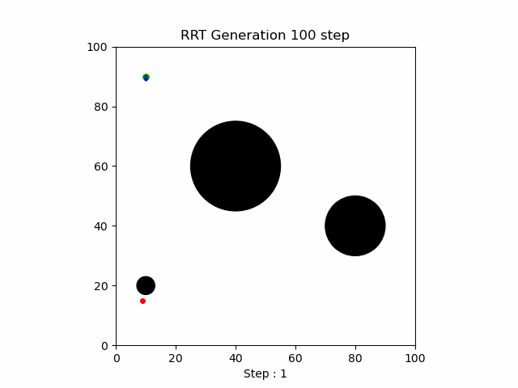

# MSRHackathon-RRT
This repository is used to solve the [RRT Challenge](https://nu-msr.github.io/hackathon/python_challenge.html) as a part of the MSR Hackathon'25 @Northwestern Univeristy

## How to run
First we start by cloning the repository:
```bash
git clone git@github.com:kjyothiswaroop/MSRHackathon-RRT.git
```
To run this code, you will need one additional python library apart from the regular ones which is imageio. This can be installed by using the command :
```bash
sudo apt install python3-imageio
```
Now we simply do :
```bash
./main.py
```
## Description
When the main.py file is run the following things take place:
* A user input is taken for the number of vertices in the tree.
* If there is no goal specified, the RRT tree will be expanding while avoiding any circular obstacles in the way.
* If goal is provided, as soon as RRT finds a direct collision free connection between a node and goal, the edge will be joined and exploration stops.

Once the RRT tree is built, it is passed on to the plotter class to plot. This class plots the RRT tree and at the end saves it to gif file inside the images/ folder.

## Example


## Author
[Kasina Jyothi Swaroop](https://github.com/kjyothiswaroop)

